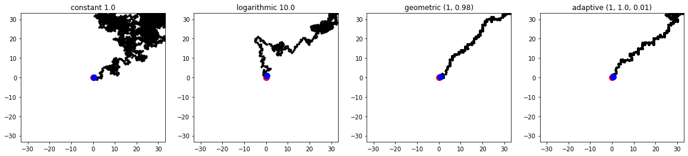
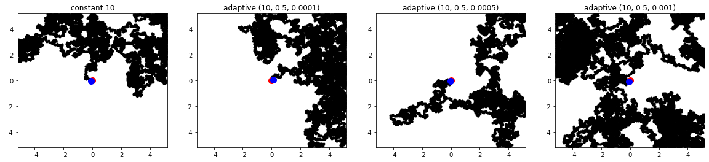
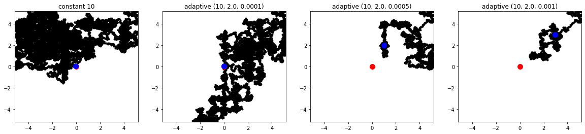

# Simulated annealing tabu search
Simulated annealing and tabu search hybrid algorithm implementation with different cooling schedules.

## Sample runs
The red dot is the target. The blue dot is the current best point that was found.

## References
- Derek Bingham. "Optimization Test Problems." <i>Simon Fraser University</i>. 2013. [[link]](https://www.sfu.ca/~ssurjano/optimization.html)
